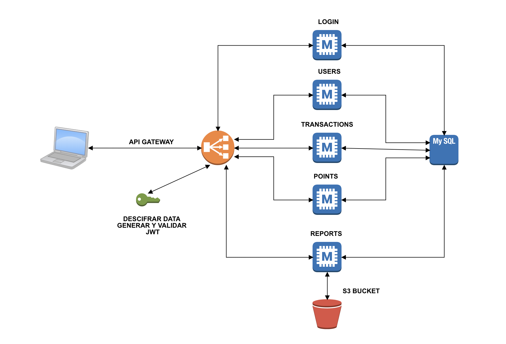

# Leal PT - Ronal Alberto Triana Tarazona

Este es el repositorio de los fuentes de la prueba tecnica desarrollada para Leal.

### Stack
Las siguientes herramientas fueron utilizadas para el desarrollo de la PT.
- NodeJS v10.15.0
- MySQL Latest (https://hub.docker.com/_/mysql)
- Docker for Mac 10.14.3
- Amazon S3

### Microservices

- [Login Service](./microservices/login)
- [Reports Service](./microservices/reports)
- [Users Service](./microservices/users)
- [Transactions Service](./microservices/transactions)
- [Points Service](./microservices/points)
- [API Gateway Service](./api-gateway)

### Como iniciar los microservicios

Debe configurar la base de datos primero.

```
# Crear y arrancar servidor MySQL con Docker
docker run -d -p 3306:3306 --name='mysql-server' --env="MYSQL_ROOT_PASSWORD=password" mysql --default-authentication-plugin=mysql_native_password

# Ingresar al servidor MySQL Docker
docker exec -ti mysql-server bash

# Primera Configuracion DB
mysql -u root -p

create database pt_leal_db;
create user 'user_leal'@'%%' identified with mysql_native_password BY 'password';
grant all privileges on pt_leal_db.* TO 'user_leal'@'%%';
flush privileges;
quit;
```

Mas detalle en [Mysql Configuracion](./scripts/database)

Luego de configurar la base de datos, se debe proceder a descargar cada micro servicio y api gateway.


Instalar dependencias y arrancar servicios con con:
```
npm i --save
npm start
```

### Aplicacion WEB 

En [Mis Datos WEB APP](./mis-datos-web-app), se creo una aplicacion sencilla para poder testear los servicios.

Para poder iniciar esta aplicacion basta con descargar y ejecutar los siguientes comandos:

```
npm i --save
nodemon start
```

### Configurar Variables de Entorno Amazon S3

Se deben configurar las siguientes variables de entorno con las politicas de acceso PUT - GET. Este bucket es utilizado para almacenar los reportes generados desde la aplicacion.

- export AWS_S3_ACCESS_KEY_ID="access_key_id"
- export AWS_S3_SECRET_ACCESS_KEY="secret_access_key"


### Archivos de Configuracion

Todos los proyectos tienen archivos de configuracion en el directorio /config con propiedades porm defecto y que pueden ser inyectadas como variables de entorno.


### Cifrado Request

En el momento solo se esta cifrando el request de Login. Se utilizan llaves que estan en el archivo de configuracion. Pueden ser inyectadas como variables de entorno. No es la manera mas sofisticada pero como solucion y demostracion es valido.

### Diagrama General

